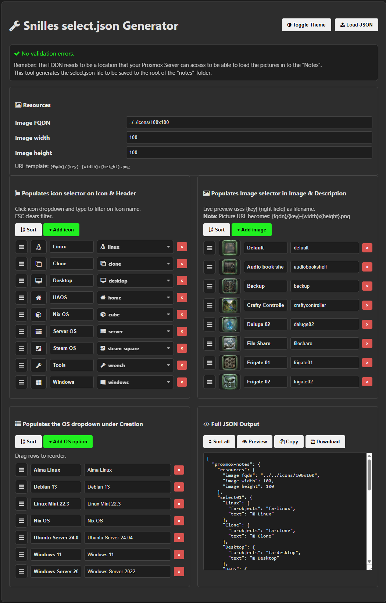

**A vibe coded small tool for creating fancy "Notes" to Proxmox VM/LXC notes "Field".**

Clone the repo, go to http://yourdomain.com/Proxmox-Note/notes/select to create your own select.json and save it in the root of the "notes" folder.

Now you can create notes at http://yourdomain.com/Proxmox-Note/notes

All icons are created with "Qwen image 2512 fp8 e4m3fn" in ComfyUI. Then editied in GIMP to fix the "transparency" background.

You can of course make your own "icons" and place them where ever your Proxmox server can access. Just update the FQDN in the select.json.

Proxmox Example:

Notes Editor:

Select.json generator:

One of the original Icons with the "workflow" embeded:

