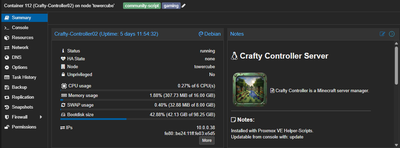
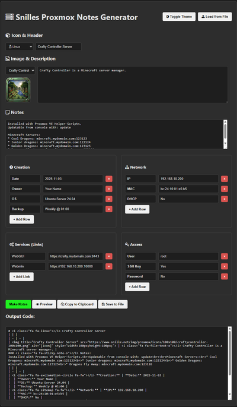
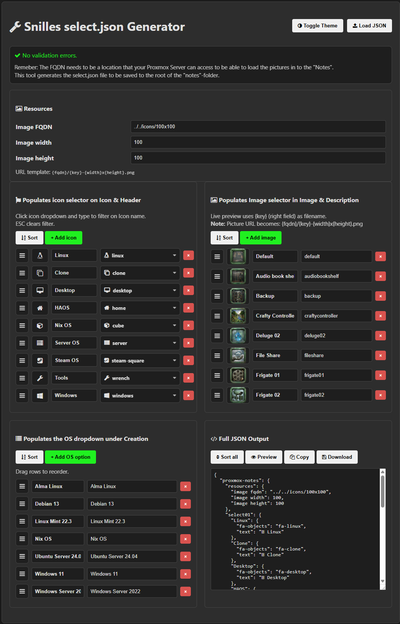

**A small tool for creating fancy "Notes" to Proxmox VM/LXC notes "Field".**

Clone the repo, go to http://yourdomain.com/Proxmox-Note/notes/select to create your own select.json and save it in the root of the "notes" folder.

Now you can create notes at http://yourdomain.com/Proxmox-Note/notes

You can of course make your own "icons" and place them where ever your Proxmox server can access. Just update the FQDN in the select.json.

Proxmox Example:

Notes Editor:

Select.json generator:

